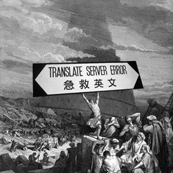

# Nimrod

/!\ TESTS YET TO BE DONE. Not production ready.

Baby Babylone Tower Handler.  
Aka, simple localization php util class.

* Accept key => value arrays as sources, but also paths to php files or to json documents. One-method-fits-all.
* Accept lists of sources too, for some bulk loading.
* If language preference not specified, will look for it in SESSION and GET superglobals. Then store it in SESSION for persistence, if not already done.
* Will figure out a fallback in case of missing translation. Unless told not to.
* Fallback permission and language can be set globally, but also overriden on text request.
* Placeholding and substitutions just require some {{handlebars}}.
* And you can plug in your PSR-3 logger of choice.


## Install

```bash
composer require ssitu/nimrod
```

Will also require [SSITU/Blueprints](https://github.com/I-is-as-I-does/Blueprints)

* `FlexLogsTrait` and
* `FlexLogsInterface` specifically.  

This is a Psr-3 "logger aware" implementation with a fallback.  
If no use of other SSITU blueprints, you can download just those two files.

## Overview


```php
use \SSITU\Nimrod\Nimrod;

require_once 'path/to/autoload.php';

$Nimrod = new Nimrod($translRsrcMap, $dfltLang, $sessionKey = 'SSITU_lang', $getKey = 'lang', $strictMode = false);
$Nimrod->t_($txtKey, $subst = [], $strict = null, $lang = null);
```

### Samples

```php
// sample config:
$dfltLang = 'en'; # ISO 639-1 is not mandatory, but a good idea
$translRsrcMap = [
    ['lang' => 'en', 'rsrc' => './transl/en-part-1.php'],
    ['lang' => 'en', 'rsrc' => './transl/en-part-2.json'],
    ['lang' => 'fr', 'rsrc' => ['hello'=>'Bonjour !', 
                                'how-are-you-X'=>'Comment ça va, {{machinette}} ?']]];
// sample subst:
$subst = ['machinette'=>'Marie-Antoinette'];
```

### Log

```php
# optional:
$Nimrod->setLogger($somePsr3Logger);
# alternatively, you can retrieve logs that way:
$Nimrod->getLocalLogs();
// if no logger set: returns all logs history;
// else: only last entry
```

## And Also

### Setters

```php
$Nimrod->set_dfltLang(string $dfltLang);
$Nimrod->set_sessionKey(string $sessionKey);
$Nimrod->set_getKey(string $getKey);
$Nimrod->set_strictMode(bool $strictMode);
$Nimrod->set_Lang(?string $langPreference = null, ?bool $strict = null);
```

### Getters

```php
$Nimrod->get_dfltLang();
$Nimrod->get_avlblLangs();
$Nimrod->get_currentLang();
$Nimrod->get_queryLang();
```

### Loaders

```php
$Nimrod->bulk_load_translRsrc(array $translRsrcMap);
$Nimrod->load_translRsrc(string $lang, array|string $rsrc);
```

### Inquirers

```php
$Nimrod->langIsAvailable(?string $lang);
$Nimrod->translIsAvailable(string $txtKey, ?string $lang);
```



## Contributing

Sure! You can take a loot at [CONTRIBUTING](CONTRIBUTING.md).

## License

This project is under the MIT License; cf. [LICENSE](LICENSE) for details.
